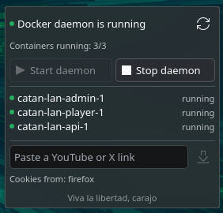
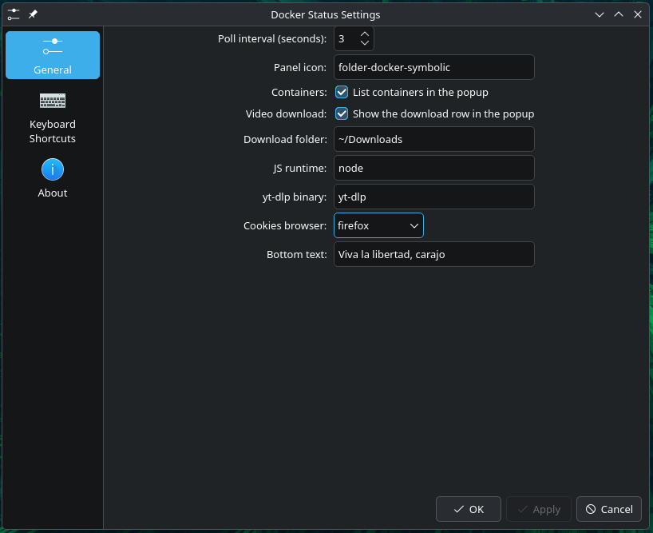

# Docker Status

**The two things every developer actually needs, one click away in the panel: a Docker daemon that is
running, and the meme video saved before it disappears.**

A KDE Plasma 6 widget for the Docker daemon. It tells you the state at a glance, starts the daemon without a
password prompt, stops it behind a deliberate confirmation, and downloads the YouTube or X link you just
pasted — no terminal, no browser tab, no `sudo` dance.




KDE Plasma 6 on Wayland, developed and verified against **Plasma 6.7.4 / plasma5support 6.7.4 / polkit 127
on CachyOS**.

---

## Install

```bash
git clone https://github.com/DaveR-ui/docker-status-widget.git
cd docker-status-widget
./install.sh install          # the widget itself — unprivileged, reversible
./install.sh install-polkit   # optional, sudo: makes "Start daemon" passwordless
./install.sh status           # what is installed, and whether Docker is up
```

Then right-click the panel or the desktop → **Add Widgets…** → search **"Docker Status"**. On the desktop
the full widget is shown directly; in the panel it collapses to the icon and the severity dot and expands
into a popup. If it does not appear, restart plasmashell:

```bash
kquitapp6 plasmashell && kstart plasmashell
```

Installing the widget needs no root, and removing it is one command. The polkit rule is the only privileged
step, it is a separate command on purpose, and it never happens implicitly.

**Requirements:** KDE Plasma 6 (`X-Plasma-API-Minimum-Version: 6.0`), Docker with `docker.service`, and —
only for downloads — a `yt-dlp` reachable on plasmashell's `PATH`, plus a JavaScript runtime (`node` or
`deno`) for YouTube.

---

## What it does

| Surface | Content |
| --- | --- |
| Panel (compact) | Theme icon (dimmed when stopped) + severity dot |
| Popup / desktop (full) | Daemon state, `running/total` container count, container list, start/stop buttons, refresh button, video-download row, bottom text |

State is reported honestly in four levels, not two:

| State | Severity | Colour |
| --- | --- | --- |
| `active` | positive | green |
| `inactive` | neutral | orange |
| `failed` | negative | red |
| `unknown` (probe failed) | muted | grey |

`unknown` is deliberately *not* rendered as "stopped": a broken probe must never
look like a healthy reading.

---

## Save the meme before it disappears

The full representation has a download row: paste a YouTube or X (Twitter) link, press the button, and
`yt-dlp` fetches the video into the configured folder, reading cookies from the configured browser
(**Firefox** by default). The row exists only in the full representation — the desktop widget or the panel
popup — never in the panel icon.

The assembled command is exactly this, with every value single-quoted by `shellQuote()`:

```
'yt-dlp' --cookies-from-browser '<browser>' --js-runtimes '<runtime>' --no-playlist --no-progress -P '<dir>' -o '%(title)s [%(id)s].%(ext)s' '<url>' # plasma-run-N
```

The `--cookies-from-browser` pair is omitted entirely when the browser setting is empty, and so is
`--js-runtimes` when that setting is empty. The trailing comment is the
pre-existing `withRunToken()` mechanism that makes a repeated one-shot re-run.

Two flags are deliberate:

- `--no-playlist`: the YouTube links people paste carry `&list=...&start_radio=1`; you want *that*
  video, not the radio mix it belongs to.
- `--no-progress`: keeps the captured output small. The widget shows a busy indicator instead of a
  progress bar.

### Safety model

This is the one place user input reaches a command, and it is bounded on purpose:

- **URL validation before a command exists.** https only; the host must match exactly one of
  `youtube.com`, `www.youtube.com`, `m.youtube.com`, `music.youtube.com`, `youtu.be`, `www.youtu.be`,
  `x.com`, `www.x.com`, `twitter.com`, `www.twitter.com`, `mobile.twitter.com`; at most 2048
  characters; once surrounding whitespace is trimmed, refused if it contains inner whitespace, a single
  quote, a double quote, a backtick, a backslash or a control character. A refused link never reaches a
  shell, and the popup says
  "Paste a YouTube or X (Twitter) link first."
- **Quoting is the actual protection.** `shellQuote()` wraps every interpolated value — URL and
  configuration alike — in single quotes and escapes an embedded quote as `'\''`. The unit tests run
  the assembled command through a real `/bin/sh` with a stub `yt-dlp` on `PATH` and assert the argv
  arrives intact.
- **Configuration supplies validated values, never a command.** A bad binary, runtime name or browser
  value falls back to its safe default; a relative or control-character download directory falls back to
  `~/Downloads`. An empty browser setting omits `--cookies-from-browser` instead of guessing.
- **yt-dlp's own configuration still applies.** There is no `--ignore-config`, so
  `~/.config/yt-dlp/config` (a PO-token plugin, a format preference) survives.

The full boundary and the rejected alternatives are recorded in
[ADR-0006](docs/adrs/adr-0006-video-downloader-command-boundary.md).

### Download prerequisites

- `yt-dlp` reachable on plasmashell's `PATH`, or an absolute path in the setting. On this machine it
  lives in `~/.local/bin`, which is on plasmashell's environment.
- For YouTube, a JavaScript runtime (`node` or `deno`). Without it, YouTube fails with
  "The page needs to be reloaded".
- Cookies from a signed-in browser for X/Twitter and for age-gated YouTube. The command passes
  `--cookies-from-browser <your setting>` (default `firefox`); leave the setting empty to send no cookies
  at all. yt-dlp resolves the browser's profile itself.

---

## Settings

Everything on the widget's config page. Every value is validated by `dockerstatus.js` before it reaches a
command, and a value it refuses falls back to the default in this table.

| Setting | Default | Meaning |
| --- | --- | --- |
| Poll interval (seconds) | `3` | How often the daemon state is re-read from systemd. |
| Panel icon | `folder-docker-symbolic` | Any icon name from the active theme. |
| List containers in the popup | on | Turns the container list off without hiding the count. |
| Show the download row | on | Hides the row entirely when off. |
| Download folder | `~/Downloads` | Videos are written here; `~/` expands to your home directory. |
| JS runtime | `node` | Passed as `--js-runtimes`; leave empty to omit the flag entirely. |
| yt-dlp binary | `yt-dlp` | Executable name or path; `~/` expands. |
| Cookies browser | `firefox` | Passed as `--cookies-from-browser`; accepts yt-dlp syntax such as `chrome:Default` or `firefox+gnomekeyring`. Leave empty to send no cookies. |
| Bottom text | `Persiguiendo la singularidad` | Muted text at the bottom of the widget. Leave empty to hide it entirely. |

## What it shows

| Surface | Content |
| --- | --- |
| Panel (compact) | Theme icon (dimmed when stopped) + severity dot |
| Popup / desktop (full) | Daemon state, `running/total` container count, container list, start/stop buttons, refresh button, download row, bottom text |

The daemon state is reported in four levels instead of two, so that a probe that fails is never mistaken
for a daemon that is stopped:

| State | Colour | Meaning |
| --- | --- | --- |
| `active` | green | the daemon is running |
| `inactive` | orange | the daemon is stopped |
| `failed` | red | the unit failed |
| `unknown` | grey | the probe could not tell |

## Starting and stopping the daemon

`systemctl start docker` needs root, and this widget wants that to be one click. The rule in
`polkit/49-docker-status-widget.rules` grants exactly one action id, one unit, one verb, from a local
active session only. It does not grant stop, restart, disable or mask.

## Layout

```
package/io.github.daver-ui.dockerstatus/
├── metadata.json                     # KPackageStructure: Plasma/Applet
└── contents/
    ├── config/main.xml               # kcfg entries -> cfg_* aliases
    ├── icons/dockerstatus.svg        # bundled app icon (metadata.json Icon: /icons/dockerstatus.svg)
    └── ui/
        ├── main.qml                  # PlasmoidItem: commands, polling, download wiring, state
        ├── CompactRepresentation.qml # panel icon + severity dot
        ├── FullRepresentation.qml    # popup/desktop: state, list, start/stop buttons, download row
        ├── SeverityDot.qml           # single severity -> colour mapping
        ├── dockerstatus.js           # pure logic incl. download boundary, unit tested in Node
        └── config/ConfigGeneral.qml  # config page (poll, icon, list, download settings)
polkit/49-docker-status-widget.rules
tests/dockerstatus.test.mjs
screenshots/                          # the two images above
docs/                                 # documentation corpus — entry point: docs/readme.md
```

Notes on the layout, both learned the hard way:

- The config page lives in `contents/ui/config/`, and `source:` in
  `contents/config/config.qml` is resolved relative to `contents/ui/` — not
  relative to `contents/`.
- `dockerstatus.js` is deliberately free of QML types so it can run under a bare
  JavaScript engine. Keep it that way.
- A setting carried by a combo box cannot be a `cfg_*` alias: Plasma's initial write lands before the
  control initialises. `ConfigGeneral.qml` keeps `cfg_cookiesBrowser` a plain property and seeds the combo
  from it in the combo's own `Component.onCompleted`.

---

## Requirements

- KDE Plasma 6 on Wayland, developed on Plasma 6.7.4 / plasma5support 6.7.4 / polkit 127 (CachyOS).
- Docker with `docker.service`. Only that unit is supported: no rootless Docker and no user-scoped daemon.
- For downloads, the optional extras listed above: `yt-dlp`, a JavaScript runtime for YouTube, and a
  signed-in browser profile for cookies.

## License

MIT — see [LICENSE](LICENSE).
